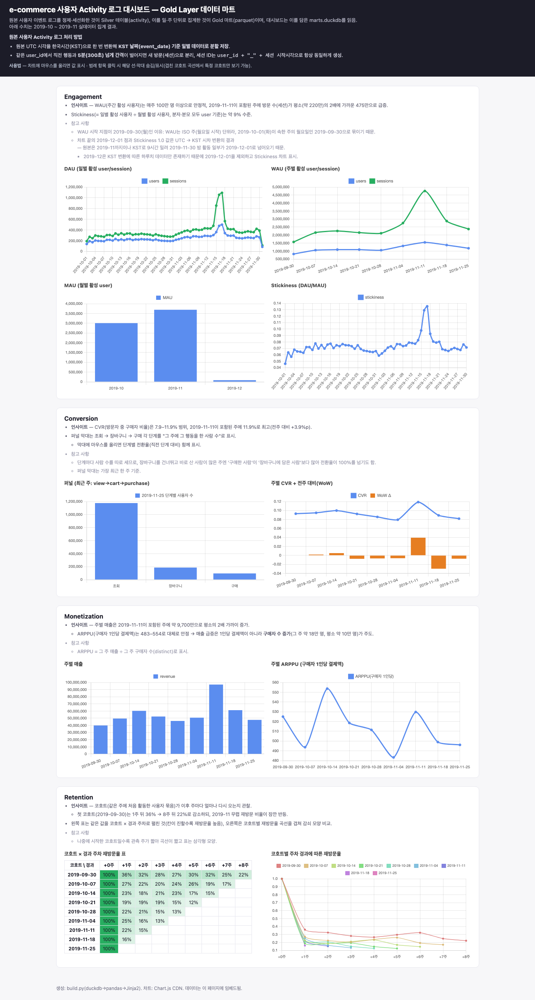

# e-commerce 사용자 Activity 로그 → Spark Application + WAU

2019년 10~11월 e-commerce 이벤트 CSV (약 13.7GB)를 단계적으로 가공해 Hive External Table로 제공하고,<br> WAU 2종을 Spark Application을 통해 측정하는 데이터 파이프라인.

| 단계 | 내용 |
|---|---|
| **원본** | `2019-Oct.csv` · `2019-Nov.csv` (약 13.7GB, UTC) |
| **변환** | dedup → KST 변환 → 5분 갭 세션화 |
| **저장** | KST 일별 파티션 parquet (snappy) |
| **서빙** | Hive External Table `activity` |
| **집계** | WAU (user_id 기준 / session_id 기준) 2종<br>— 실제 Spark 실행으로 실측 |

- **언어/실행**: Scala + sbt + 로컬 Spark (local 모드). 빌드한 jar를 `spark-submit`으로 실행.
  - jar에는 Spark 라이브러리를 넣지 않음 (thin jar)
  - 실행 환경인 `spark-submit`에 Spark가 이미 설치돼 있어, jar에는 애플리케이션 코드만 담으면 충분함 → jar 용량이 작고 Spark 버전 충돌도 피함.
- **카탈로그**: Hive External Table + Spark 임베디드 Derby 메타스토어 (별도 메타스토어 서비스 없이 구동)
- **설계 근거 전문**: [설계 스펙](docs/superpowers/specs/2026-06-07-wau-activity-log-design.md) · [구현 계획](docs/superpowers/plans/2026-06-07-wau-activity-log.md)
- **라이브 대시보드** (GitHub Pages): <https://benidjor.github.io/ecommerce-user-activity-log/> ([§9](#9-라이브-대시보드-확장))

---

## 1. 요구사항

원본 요구사항을 영역별로 정리하고, 각 항목의 충족 위치를 함께 표기.

### 1.1. 핵심 과업

- 사용자 activity 로그를 **Hive 테이블로 제공하는 Spark Application** 작성
- 해당 테이블 기반 **WAU (Weekly Active Users) 계산**

### 1.2. 대상 데이터

- `2019-Oct.csv` · `2019-Nov.csv` — [Kaggle: ecommerce-behavior-data-from-multi-category-store](https://www.kaggle.com/mkechinov/ecommerce-behavior-data-from-multi-category-store)

### 1.3. 요구사항 구현 요약

요구사항별 **방식 / 코드 / 검증**을 정리. 설계 근거·대안은 [§5 주요 설계 결정과 근거](#5-주요-설계-결정과-근거), 데이터 흐름은 [§2 아키텍처](#2-아키텍처--데이터-흐름) 참고.

| # | 요구사항 | 구현 요약 |
|---|---|---|
| 1 | KST 기준 daily partition | 이벤트 `event_date` (KST) 기준 파티션 분할 |
| 2 | 5분 갭 세션 ID | 간격 5분 이상이면 새 세션, 결정적 `session_id` |
| 3 | parquet · snappy 재처리 | 하루 단위 멱등 overwrite |
| 4 | External Table + 추가 기간 | 새 파티션만 덧붙이고 `MSCK REPAIR` 등록 |
| 5 | 배치 장애 복구 | staging·rename · 검증 게이트 · 멱등 + Airflow |
| 6 | WAU 2종 | `COUNT(DISTINCT user_id/session_id)`, 월요일 시작 주 |

#### (1) KST 기준 daily partition
- **구현** 적재 시 UTC → KST 1회 변환, 이벤트 `event_date` (KST) 기준으로 파티션 분할
- **코드** [`TimeUtils`](src/main/scala/com/activitylog/TimeUtils.scala) · [`PartitionWriter`](src/main/scala/com/activitylog/PartitionWriter.scala)
- **검증** [파티션 62개 실측](docs/runbook/full-backfill.md)
- **근거** [§5 결정 2 (자정·파티션 경계) · 4 (타임존)](#5-주요-설계-결정과-근거)

#### (2) 동일 `user_id`에서 `event_time` 간격 5분 이상이면 세션 종료·새 세션 ID
- **구현** `user_id` 윈도우를 시간순 정렬해 간격이 5분 이상이면 새 세션 시작. `session_id`는 입력값 (`user_id` + 세션 시작 시각)만으로 산출해 같은 데이터면 늘 같은 값
- **코드** [`Sessionizer`](src/main/scala/com/activitylog/Sessionizer.scala)
- **검증** [`SessionizerSpec` 경계 6케이스](src/test/scala/com/activitylog/SessionizerSpec.scala)
- **근거** [§5 결정 1 (session_id 생성)](#5-주요-설계-결정과-근거)

#### (3) 재처리 후 parquet · snappy
- **구현** 하루 단위로 멱등 overwrite하며 parquet (snappy)로 기록
- **코드** [`PartitionWriter`](src/main/scala/com/activitylog/PartitionWriter.scala)
- **검증** DDL [`STORED AS PARQUET`](sql/create_external_table.sql) · 쓰기 [`compression=snappy`](src/main/scala/com/activitylog/PartitionWriter.scala)
- **근거** [§5 결정 6 (멱등 overwrite)](#5-주요-설계-결정과-근거)

#### (4) External Table 설계 + 추가 기간 처리 대응
- **구현** 데이터 파일과 테이블 정의를 분리해, 새 기간은 새 `event_date=` 파티션만 덧붙이고 `MSCK REPAIR`로 등록 (테이블 재생성 불필요). 증분은 세션이 자정을 넘는 경우까지 잇기 위해 전날 (D-1)을 함께 읽어 경계를 계산하되 대상일 파티션만 기록
- **코드** [`create_external_table.sql`](sql/create_external_table.sql) · [`Main`](src/main/scala/com/activitylog/Main.scala) (`--mode incremental`)
- **검증** [`MSCK REPAIR` 등록](docs/runbook/full-backfill.md) · [backfill·incremental이 같은 결과 내는지 실측](results/backfill_incremental_equiv.txt) (D=2019-10-03, 양방향 `EXCEPT ALL`=0)
- **근거** [§5 결정 7 (테이블) · 8 (실행 모델)](#5-주요-설계-결정과-근거)

#### (5) 배치 장애 복구 장치
- **구현** staging에 먼저 쓰고 rename으로 원자 교체, 행수·키 null 검증 게이트, 파티션별 `_SUCCESS`, 하루 단위 멱등 overwrite. 운영 재시도·알림은 Airflow retry + Discord 웹훅
- **코드** [`PartitionWriter`](src/main/scala/com/activitylog/PartitionWriter.scala) · [`airflow/`](airflow/README.md)
- **검증** [Airflow 장애 2모드 시연](airflow/README.md): (a) 일시적 오류 자동 retry 복구 (b) 검증 게이트 실패 후 입력 교정·멱등 재처리
- **근거** [§5 결정 6 (장애 복구)](#5-주요-설계-결정과-근거)

#### (6) Hive 테이블로 WAU 2종 (user_id 기준 · session_id 기준 · 결과·쿼리 동봉)
- **구현** Hive `activity`에서 `COUNT(DISTINCT user_id)` / `COUNT(DISTINCT session_id)`를 월요일 시작 주 (ISO 8601) 단위로 집계
- **코드** [`sql/wau.sql`](sql/wau.sql) · [`WauQueries`](src/main/scala/com/activitylog/WauQueries.scala)
- **검증** [§3 실측 표](#3-wau-실측-결과) · [`results/`](results/)
- **근거** [§5 결정 3 (WAU 주 경계)](#5-주요-설계-결정과-근거)

### 1.4. 언어 제약

- Spark Application 구현 언어는 **Scala 또는 Java로 제한**, 선택 사유 기술 → [§4 Scala 선택 이유](#4-scala-선택-이유)

---

## 2. 아키텍처 / 데이터 흐름

```
raw CSV (UTC)          Spark App (Scala)
─────────────          ─────────────────
2019-Oct.csv           ① DEDUP        자연키 (user_id, event_time, event_type, product_id) 1건 유지
2019-Nov.csv  ─────▶   ② TZ           UTC → KST 1회 변환 → event_time_kst · event_date (파생)
               read    ③ SESSIONIZE   Window (user_id, event_time_utc), gap ≥ 5분 → 새 세션
                                      session_id = user_id + "_" + unix (세션 시작 시각)
                       ④ WRITE        parquet + snappy → _staging/event_date=D/
                                        │  검증 게이트 통과 시에만
                                        ▼
                       ⑤ ATOMIC SWAP  rename _staging → event_date=D/
                       ⑥ MARK         _SUCCESS (맨 마지막)
                                        │
                                        ▼
                       Hive External Table  activity
                       (PARTITIONED BY event_date, STORED AS PARQUET)
                                        │  소비자는 _SUCCESS 있는 파티션만 읽음
                                        ▼
                       WAU 쿼리 (ISO week 월요일 시작, KST)
                       COUNT(DISTINCT user_id) / COUNT(DISTINCT session_id)
```

핵심 설계 포인트:

- **파티션 = 이벤트의 `event_date` (KST)** (세션 단위 아님)
  - 세션이 자정을 넘으면 같은 `session_id`가 두 파티션에 나뉘어 들어감 (정상)
- **세션화 정렬은 원본 `event_time_utc` 기준**, 파티션용 `event_date`만 KST에서 파생
  → 변환 지점이 하나뿐이라 일관성 확보
- **`session_id`는 입력값만으로 산출** (`min(세션 시작 시각)` 기반이라 같은 데이터면 늘 같은 값)
  → backfill 전역 세션화와 incremental (전날 lookback) 재계산 결과가 동일 (멱등)

출력 스키마는 [설계 스펙 §3](docs/superpowers/specs/2026-06-07-wau-activity-log-design.md) 참고.

---

## 3. WAU 실측 결과

**전체 Oct+Nov backfill (파티션 62개, 2019-10-01~2019-12-01 KST) 기준, 실제 `spark-sql` 실행 결과.**

전문: [results/wau_users.txt](results/wau_users.txt) · [results/wau_sessions.txt](results/wau_sessions.txt)

| week_start (KST, 월요일) | WAU users | WAU sessions | sessions / users |
|---|---:|---:|---:|
| 2019-09-30 | 818,388 | 1,570,536 | 1.92 |
| 2019-10-07 | 1,057,958 | 2,154,180 | 2.04 |
| 2019-10-14 | 1,090,898 | 2,257,214 | 2.07 |
| 2019-10-21 | 1,093,146 | 2,153,837 | 1.97 |
| 2019-10-28 | 1,054,722 | 2,115,233 | 2.01 |
| 2019-11-04 | 1,321,141 | 2,751,842 | 2.08 |
| 2019-11-11 | 1,543,309 | 4,754,423 | 3.08 |
| 2019-11-18 | 1,376,755 | 2,876,494 | 2.09 |
| 2019-11-25 | 1,176,254 | 2,376,156 | 2.02 |

사용 쿼리 ([sql/wau.sql](sql/wau.sql)):

```sql
-- 주 경계 = ISO week(월요일 시작), KST event_date 기준
SELECT date_trunc('week', to_date(event_date)) AS week_start,
       COUNT(DISTINCT user_id) AS wau_users
FROM activity GROUP BY 1 ORDER BY 1;

SELECT date_trunc('week', to_date(event_date)) AS week_start,
       COUNT(DISTINCT session_id) AS wau_sessions
FROM activity GROUP BY 1 ORDER BY 1;
```

해석:

- **두 지표의 정의 차이** — user WAU는 주별 고유 사용자 수, session WAU는 주별 고유 세션 수.
  - `session_id`에 `user_id`가 포함되고 한 사용자가 보통 한 주에 여러 세션을 만들므로, 매주 session WAU가 user WAU보다 큼 (위 표의 `sessions / users` 비율 약 1.9~3.1배)
- **활성 사용자 규모** — user WAU는 주당 약 82만~154만 명 범위에서 변동.
  - 10월에는 약 105만~109만 명으로 비교적 평탄하다가 11월 들어 130만~154만 명으로 상승.
- **11월 중순 세션 급증** — 11-11 시작 주에 session WAU가 4.75M로 다른 주 (약 2.1~2.9M)보다 크게 튐.
  - 같은 구간의 원본 행수 급증 (11/15~17)과 일치 — 사용자 수 증가폭보다 세션·이벤트 증가폭이 커서 `sessions / users` 비율도 3.08로 유일하게 3을 넘음 (1인당 활동량이 늘어난 구간으로 해석)
- **Week 경계 주의** — 첫 주 (09-30)는 데이터가 10-01부터 시작, 마지막 주 (11-25)는 12-01 파티션까지만 존재.
  - 둘 다 7일이 채워지지 않은 부분 주라, 추세 비교 시 이 두 점은 과소 집계로 읽어야 함.

---

## 4. Scala 선택 이유

- **Spark 네이티브 언어** — 최신 API/성능을 1급으로 지원하고, `Dataset`의 타입 안정성 활용 가능
- **세션화 로직 표현력** — 윈도우 함수 (`lag`/`sum over`)·UDF 등 핵심 로직을 타입 안전하게 표현
- **대안 비교** — Java도 가능하나 Spark 관용 표현·간결성에서 Scala 우위. PySpark는 언어 제약 (Scala/Java)으로 제외

### 4.1. Scala와 Python 사용 범위

데이터를 **변환**하는 코드는 전부 Scala로 작성하고, 그 결과를 **엮고·서빙하는** 코드만 Python으로 작성.

| 구성요소 | 언어 | 이유 |
|---|---|---|
| 파이프라인 본체 `Main` · `DailySplitter` · `GoldMarts` | **Scala** | Spark Application (실제 데이터 변환) |
| 마트 export·정적 빌드·CI (`dashboard/`) | **Python** | Spark 외 서빙 레이어 (duckdb / pandas / jinja2) |
| Airflow DAG·Discord 콜백 (`airflow/`) | **Python** | 오케스트레이션·알림 |

- WAU 정본은 Hive `activity` + `sql/wau.sql`이고, 대시보드의 `marts.duckdb`는 Gold 서빙 사본 (Hive 대체가 아님)
- 전체 언어 사용 범위의 자세한 설명은 [airflow/README.md §1](airflow/README.md) 참고

---

## 5. 주요 설계 결정과 근거

핵심 결정 9개를 항목별로 정리. 전체 근거·대안 검토는 [설계 스펙 §7](docs/superpowers/specs/2026-06-07-wau-activity-log-design.md)에 있음.

#### (1) session_id 결정적 생성 (원본 `user_session` 미사용)
- 원본 `user_session` 컬럼은 신뢰하기 어려워 사용하지 않고, `user_id + "_" + unix(세션 시작 시각)` 형태로 직접 생성
- 값이 결정적이라 backfill·incremental 어느 쪽으로 재계산해도 같은 id가 나옴 (멱등)
- 원본 `user_session`은 비교·검증용 컬럼으로 보존

#### (2) 파티션 경계는 이벤트 날짜 기준 (세션 단위 아님)
- 파티션은 세션이 아니라 **이벤트의 `event_date` (KST)** 기준으로 분할
- 세션화는 직전 이벤트만 보는 backward-only 방식이라, backfill은 전역 1회·증분은 전날 (D-1) lookback으로 처리
- 세션이 자정을 넘으면 같은 `session_id`가 두 날짜 파티션에 나뉘어 들어감 (정상)

#### (3) WAU 주 경계는 월요일 시작 주 (ISO 8601)
- 한 주의 시작을 월요일로 두는 ISO 8601 주 기준 (KST). 예) 화·수요일 활동도 그 주 월요일에 묶임
- `date_trunc('week', to_date(event_date))`로 주 시작일 (월요일)을 계산

#### (4) 타임존은 적재 시 1회 변환
- 원본 `event_time` (UTC)을 적재 시 KST로 **한 번만** 변환해 `event_time_kst`·`event_date`를 파생
- 세션 정렬은 원본 UTC 기준이라 변환 지점이 하나뿐이고, 그만큼 타임존 오류 여지가 작음

#### (5) dedup은 세션화 전 1건 유지
- 자연키 `(user_id, event_time, event_type, product_id)`가 같은 행은 1건만 유지
- 세션화 전에 수행해 중복이 5분 갭 계산을 왜곡하지 않게 함
- 실측 중복률 약 0.06%

#### (6) 장애 복구는 다층 장치
- 단일 장치에 기대지 않고 원자 교체·검증 게이트·완료 마커·멱등 재처리를 겹쳐, 한 층이 막혀도 다음 층이 받도록 함 (구체 장치·코드는 §1.3 요구사항 5)
- retry·알림은 파이프라인에 넣지 않고 Airflow 콜백 + Discord 웹훅에 위임해 오케스트레이션 관심사를 분리
- 스트림 전용 기능인 checkpoint는 배치에 불필요해 사용하지 않음

#### (7) 고전적 Hive External Table 채택
- Hive External Table + Spark 임베디드 Derby 메타스토어로 구성
- 별도 메타스토어 서비스를 띄우지 않고 로컬에서 구동

#### (8) 실행 모델은 backfill 1회 + incremental 설계
- 전체 적재는 backfill 1회로 완료하고, 증분 처리는 `--mode`·`--run-date` 인자로 대응하도록 설계

#### (9) 언어는 Scala + 로컬 Spark
- Spark Application은 Scala로 작성하고 thin jar를 `spark-submit`으로 로컬 실행. 언어 선택 사유 (Java·PySpark 대안 비교)는 [§4](#4-scala-선택-이유) 참고

---

## 6. 실행법

상세·검증된 절차는 런북 참고. 아래는 요약.

- 샘플 (Oct 20만 행) end-to-end: [docs/runbook/sample-e2e.md](docs/runbook/sample-e2e.md)
- 전체 (Oct+Nov) backfill + WAU 실측, 추가 기간 incremental 처리: [docs/runbook/full-backfill.md](docs/runbook/full-backfill.md)
- (확장) Airflow 일별 오케스트레이션 + 장애 2모드 시연: [airflow/README.md](airflow/README.md)

```bash
# 0. 테스트 (세션화 경계 케이스 중심)
sbt test

# 1. thin jar 빌드 (Spark 제외 경량 jar)
sbt package   # target/scala-2.13/activity-log_2.13-0.1.0.jar

# 2. 전체 backfill 적재 (driver-memory 8g)
spark-submit --class com.activitylog.Main --master "local[*]" --driver-memory 8g \
  --conf spark.sql.session.timeZone=UTC --conf spark.sql.shuffle.partitions=200 \
  --conf spark.driver.extraJavaOptions="--add-opens=java.base/java.nio=ALL-UNNAMED --add-opens=java.base/sun.nio.ch=ALL-UNNAMED" \
  target/scala-2.13/activity-log_2.13-0.1.0.jar \
  --mode backfill --input "$(pwd)/data/2019-Oct.csv,$(pwd)/data/2019-Nov.csv" --output "$(pwd)/output/activity"

# 3. 외부 테이블 등록
sed "s|{{OUTPUT_DIR}}|$(pwd)/output/activity|" sql/create_external_table.sql > /tmp/ddl.sql
spark-sql --conf spark.sql.session.timeZone=UTC -f /tmp/ddl.sql

# 4. WAU 조회 (driver-memory 8g 필수 — COUNT(DISTINCT session_id) OOM 방지)
spark-sql --driver-memory 8g --conf spark.sql.session.timeZone=UTC \
  --conf spark.sql.shuffle.partitions=200 -f sql/wau.sql
```

> JDK: `sbt test`는 JDK17, `spark-submit`/`spark-sql`은 brew JDK21. 둘 다 Spark 4 지원이며 `--add-opens` 필요 ([docs/troubleshooting/jdk-toolchain.md](docs/troubleshooting/jdk-toolchain.md))

---

## 7. AI 도구 활용

무엇을 AI로, 무엇을 직접 했는지와 프롬프트 전략 명시.

```
brainstorming           writing-plans            subagent-driven-development          verification-before-completion
숨은 결정 선질문     ──▶    설계 스펙·구현 계획    ──▶    Task 단위 구현                   ──▶    WAU 실측 검증
                                                 (구현 → spec 리뷰 → code 리뷰)

                     karpathy 4원칙 (Think · Simplicity · Surgical · Goal) — 모든 코드 태스크에 공통 적용
```

### 7.1. 사용 도구

#### (1) 방법론 — `superpowers` + `karpathy-guidelines` 조합.
- `superpowers`: `brainstorming` (숨은 결정 선질문) · `test-driven-development` (실패 테스트 우선) · `verification-before-completion` (실행 결과로만 완료 주장)
- `karpathy-guidelines`: Think (코딩 전 사고) · Simplicity (단순 우선) · Surgical (수술적 변경) · Goal (검증 가능한 목표)
#### (2) 설계/계획 — `superpowers:writing-plans`로 설계 스펙과 구현 계획을 로컬에 산출.
- 결정 로그·핵심 로직 명세를 먼저 문서로 확정한 뒤 구현에 착수.
#### (3) 구현 — `superpowers:subagent-driven-development`로 계획을 Task 단위로 실행.
- 태스크마다 구현 → spec 리뷰 → code quality 리뷰 게이트를 거침.
#### (4) 검증 — `superpowers:verification-before-completion`.
- WAU 수치는 추정이 아니라 실제 Spark 실행 결과로만 보고.
#### (5) 의도적 미사용 
- ultraplan (웹 Claude Code + GitHub 필요, 가치 중복) · Ouroboros (외부 도구라 설정 부담이 큼)
- 검토 후 작업 규모에 비해 무거워 로컬 도구로 대체.
#### (6) 대시보드 (Phase 2) 
  - DuckDB (임베디드 파일) + pandas + Jinja2 정적 빌드, Chart.js (CDN), GitHub Actions → GitHub Pages.
  - Spark 외 서빙 레이어라 Python 사용. 지표 정의·데이터 경계는 [런북 §6](docs/runbook/dashboard.md) 참고.

### 7.2. 역할 분담

**AI로 한 것**

- 빌드/테스트 골격·CLI 파싱 등 보일러플레이트 스캐폴딩
- 설계 문서 초안화
- 데이터 디자인 패턴 책 교차참조
- 트러블슈팅·런북 문서화

**직접 설계·검증한 것**

- 숨은 결정 9개 확정 (세션 정의·타임존·주 경계·dedup·복구·자정 경계 등)
- 세션화 로직 TDD (경계 케이스)
- **WAU 수치 실측 검증**
- 원본 `user_session` vs 생성 `session_id` 비교 검증

### 7.3. 프롬프트 전략

- `brainstorming`으로 숨은 결정 선질문 → 설계 스펙 승인 → `TDD`로 핵심 로직 (세션화) → **샘플 우선** end-to-end 1회 → **전체 1회 실측**.
- 각 코드 태스크는 karpathy 4원칙 (불확실하면 질문, 최소 코드, 수술적 변경, 검증까지 루프) 적용.

---

## 8. 한계점 및 향후 확장 방향

| 항목 | 현재 | 확장 방향 |
|---|---|---|
| 파티션 overwrite | 파티션별 staging+rename 루프 (원자성·검증 게이트 우선) | `partitionOverwriteMode=dynamic`은 코드는 줄지만 비원자·검증 약화<br>→ 미채택 |
| 쓰기 원자성 | rename은 로컬/HDFS에서 원자적 | S3는 copy+delete라 비원자<br>→ **Iceberg/Delta committer**로 승급 |
| WAU 쿼리 이중화 | `WauQueries.scala` (테스트용) + `sql/wau.sql` (실측용)에 동일 쿼리 | SoT 이원화<br>→ 한쪽을 다른 쪽에서 로드해 단일화 여지 |
| `price` 타입 | `double` (현 범위는 집계에 price 미사용) | 금액 정밀도가 필요하면 `Decimal`로 (부동소수 오차 회피) |
| dedup 결정성 | 자연키 1건 유지 + 안정 정렬 `row_number`로 결정 | 완전 동일 행은 어느 것이 남아도 결과 동일 (무해) |
| 검증 게이트 ④ | "결과 파티션 날짜==기대"는 Main이 `event_date` 필터 후 파티션별 write라 구조적으로 보장<br>→ 별도 단언 생략 | 없음 |
| `ActivityPipeline.readAndTransform` | 미사용 (Main은 raw 재사용 위해 `transform(raw)` 직접 호출) | 정리 후보 |
| 입력 견고성 | PERMISSIVE 파싱 + 손상 행 카운트 | 풀 dead-letter quarantine + replay |
| 세션화 | backfill 전역 / incremental 전날 lookback | 초장시간 세션 대비 Stateful Sessionizer (state store) |
| 오케스트레이션 | (확장·구현) Airflow `activity_daily` DAG, BashOperator + spark-submit, `catchup=True`=backfill, 장애 2모드 시연<br>→ [airflow/README.md](airflow/README.md) | LocalExecutor+Postgres<br>→ Celery/K8s, SparkSubmitOperator |

---

## 9. 라이브 대시보드

코어 파이프라인 위에 메달리온 Gold 마트를 얹어 만든 BI 대시보드
Silver `activity`를 집계한 Gold 마트를 DuckDB로 export하고 정적 HTML로 빌드해 GitHub Pages로 서빙.

- **라이브**: <https://benidjor.github.io/ecommerce-user-activity-log/>
- **지표 구성**:
  - Engagement — DAU/WAU (user·session) · MAU · Stickiness
  - Conversion — CVR (전환율) · 퍼널 (view → cart → purchase)
  - Monetization — 주별 매출 · ARPPU
  - Retention — 코호트 (첫 활동 주) 기준 리텐션
- **지표 정의·데이터 경계**: [docs/runbook/dashboard.md §6](docs/runbook/dashboard.md)
- **빌드·배포 절차**: [docs/runbook/dashboard.md](docs/runbook/dashboard.md)



*Gold 마트 기반 BI 대시보드 (GitHub Pages 라이브) — Engagement (DAU/WAU/MAU·Stickiness) · Conversion (CVR·퍼널) · Monetization (주별 매출·ARPPU) · Retention (코호트) 지표를 한 화면에 표시*

---

## 10. 프로젝트 구조 / 문서 맵

```
ecommerce-user-activity-log/
├── src/main/scala/com/activitylog/      # Spark Application (Scala)
│   ├── Schema.scala                      #   입력 CSV 스키마 정의
│   ├── Dedup.scala                       #   자연키 dedup(세션화 전)
│   ├── TimeUtils.scala                   #   UTC→KST 1회 변환, event_date 파생
│   ├── Sessionizer.scala                 #   5분 갭 세션화, 결정적 session_id
│   ├── ActivityPipeline.scala            #   transform 합성(dedup→tz→session)
│   ├── PartitionWriter.scala             #   staging+rename 원자 쓰기·검증 게이트·_SUCCESS
│   ├── WauQueries.scala                  #   WAU 쿼리(테스트용)
│   ├── SparkSessionFactory.scala         #   SparkSession 생성
│   ├── Main.scala                        #   엔트리포인트(--mode backfill/incremental, --run-date)
│   ├── DailySplitter.scala               #   (확장) 월 CSV → KST 일별 Bronze 분할(Phase 0)
│   └── GoldMarts.scala                   #   (확장) Gold 마트 집계 러너(sql/gold/*.sql 실행)
├── src/test/scala/com/activitylog/      # 테스트(세션화 경계 케이스 중심) + SparkTestBase
├── sql/
│   ├── create_external_table.sql         # Hive External Table DDL(파티션·parquet)
│   ├── wau.sql                           # WAU 정본 쿼리(user_id / session_id)
│   └── gold/*.sql                        # (확장) Gold 마트 SQL(SoT): dim_date·fact·mart_*
├── results/                              # WAU 실측치(커밋됨): wau_users.txt · wau_sessions.txt
├── airflow/                              # (확장) 오케스트레이션(Python) — README.md 참고
│   ├── dags/activity_daily.py            #   @daily catchup DAG
│   ├── callbacks/discord.py              #   Discord 웹훅 콜백(stdlib urllib)
│   ├── shims/setproctitle.py             #   macOS fork SIGSEGV 셰임
│   └── tests/                            #   test_dag.py · test_discord.py
├── dashboard/                            # (확장) Phase 2 서빙(Python)
│   ├── export_duckdb.py                  #   Gold → marts.duckdb
│   ├── build.py + templates/             #   정적 index.html 빌드(Jinja2)
│   └── tests/                            #   test_export.py · test_build.py
├── .github/workflows/pages.yml          # GitHub Pages 배포 CI
├── docs/
│   ├── superpowers/specs/                # 설계 스펙(결정 로그 9개 + 핵심 로직 명세)
│   ├── superpowers/plans/                # 구현 계획(Task 단위 코드/명령/기대결과)
│   ├── runbook/                          # 실행 절차: sample-e2e · full-backfill · dashboard · airflow
│   ├── troubleshooting/                  # 환경·빌드·실행 이슈 모음(README.md = 색인)
│   ├── notes/                            # 개념 노트: single-pipeline-two-drivers
│   ├── conventions/                      # 커밋·PR 컨벤션(SoT)
│   ├── ai-tooling.md                     # AI 도구 조합·선택 근거
│   └── assets/                           # 시연 캡처: airflow/ · dashboard/
├── build.sbt                            # 빌드 정의(JDK add-opens 반영)
└── README.md                            # 본 문서
```
