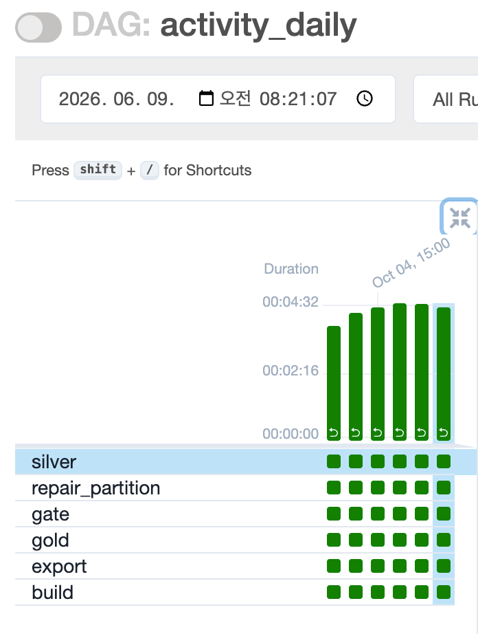
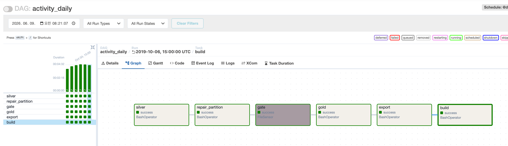
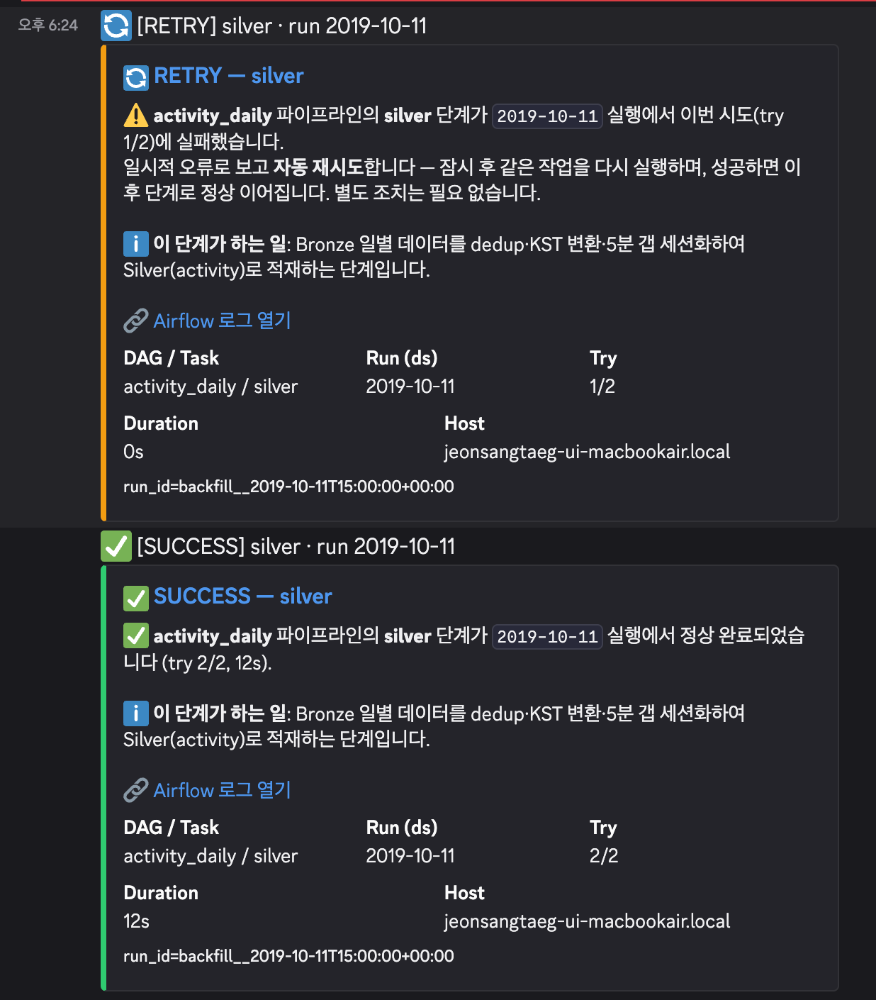
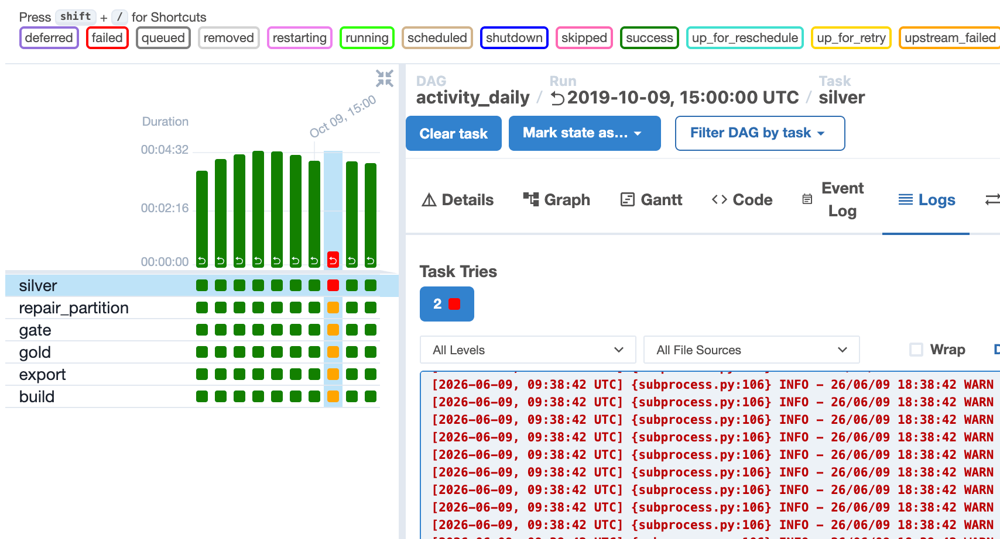
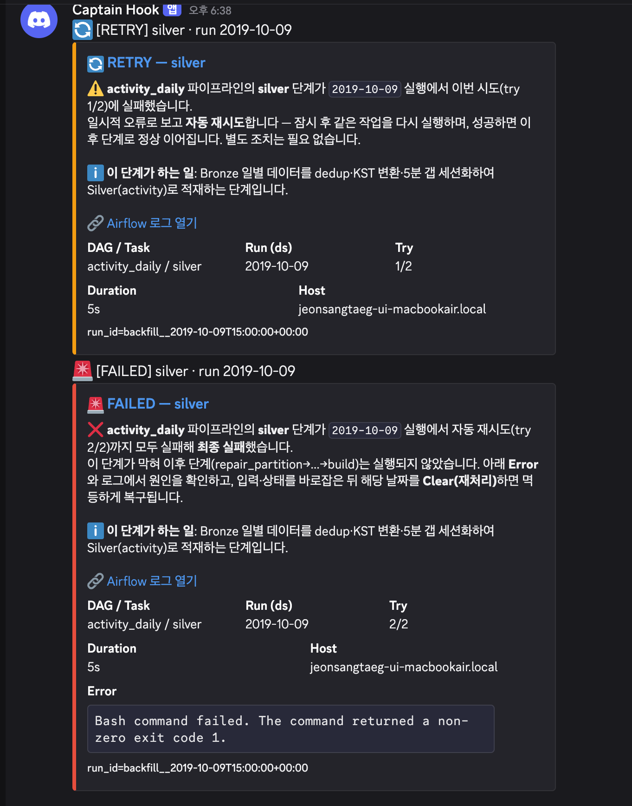
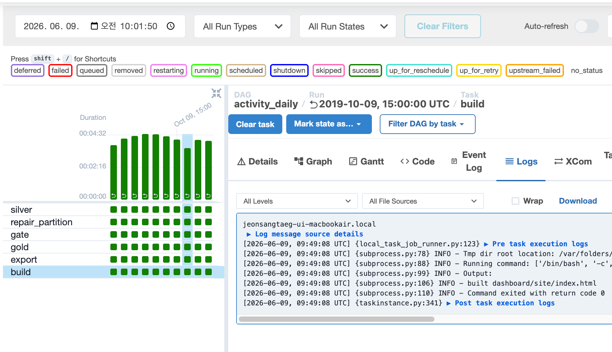
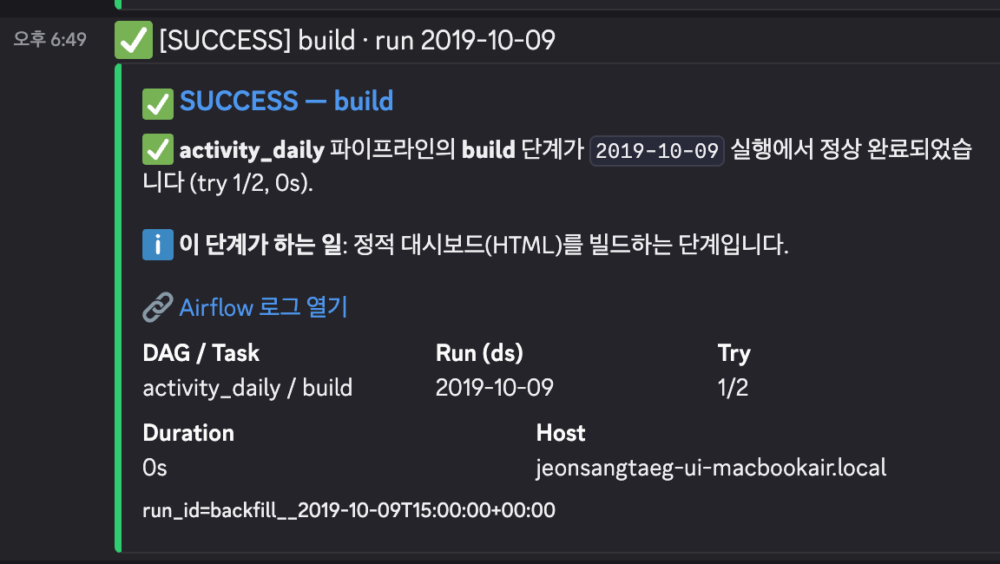

# Airflow 오케스트레이션 & 장애 복구 (확장)

코어 (WAU + Hive External Table) 완성·검증 후, **같은 파이프라인**을 Airflow DAG `activity_daily`로 일별 오케스트레이션하고 장애 복구를 시연하는 확장 레이어.

변환 코드를 새로 만들지 않고 (별도 파이프라인 아님) 동일한 `spark-submit`/`python` 명령을 BashOperator로 엮는 **상위 자동화 레이어**.

- 실행 절차: [docs/runbook/airflow.md](../docs/runbook/airflow.md)
- 개념 (단일 파이프라인·두 실행 방식): [docs/notes/single-pipeline-two-drivers.md](../docs/notes/single-pipeline-two-drivers.md)
- 로컬 구동 함정 (macOS): [docs/troubleshooting/airflow-local-macos.md](../docs/troubleshooting/airflow-local-macos.md)
- 메인 문서: [../README.md](../README.md)

---

## 1. 언어 경계 (변환은 Scala, 엮기·알림·서빙은 Python)

- **Scala (Spark Application)** — 파이프라인 본체 (`Main`)·`GoldMarts`·**`DailySplitter`** (월 CSV → KST 일별 Bronze 분할, Phase 0)
- **Python (Spark 외 레이어)** — Airflow DAG·Discord 콜백 (`airflow/`), 대시보드 export/build (`dashboard/`)
  콜백은 stdlib `urllib` 웹훅이라 추가 의존성 0.
- 즉 **데이터를 변환하는 코드는 전부 Scala**, 그것을 **엮고·알리고·서빙하는 코드만 Python**.

```
airflow/
├── dags/activity_daily.py     # @daily catchup DAG (silver→repair→gate→gold→export→build)
├── callbacks/discord.py       # Discord 웹훅 콜백(stdlib urllib, on_retry/on_failure/on_success)
├── shims/setproctitle.py      # macOS fork SIGSEGV 회피 shim
├── tests/                     # test_dag.py · test_discord.py
└── requirements.txt
```

---

## 2. 흐름 (단일 파이프라인, 두 실행 방식)

```
월 CSV
  │  DailySplitter (Scala)
  ▼
data/daily/event_date=D/   (Bronze 일별 랜딩 · Phase 0)
  │  @daily catchup (2019-10-01 ~ 2019-12-01 KST, SequentialExecutor, max_active_runs=1)
  ▼
silver ──▶ repair_partition (MSCK) ──▶ gate (FileSensor _SUCCESS) ──▶ gold ──▶ export ──▶ build
(Main incremental, --run-date {{ds}} + 전날 lookback)         (GoldMarts 전체 재계산·멱등)
```

- DailySplitter는 **Airflow 일별 run이 "자기 날짜 폴더만" 읽게** 하려는 입력 전제.
  수동 backfill은 월 CSV를 직접 읽으므로 DailySplitter 불필요.
- Silver/Gold 산출물은 수동 경로와 **동일 테이블** (`output/activity`·`output/gold`) — Airflow는 결과를 대체하는 게 아니라 같은 결과를 자동 생산 (멱등이라 동치, 수치는 코어 단계에서 실측)
- 더 자세한 설명 (왜 DailySplitter인가·Airflow가 기존을 대체하나·도식·비교표): [docs/notes/single-pipeline-two-drivers.md](../docs/notes/single-pipeline-two-drivers.md)

---

## 3. 복구 장치 ↔ 장애 매핑

| 장애 유형 | 복구 장치 | 데모 |
|---|---|---|
| 일시적 오류 (자원·네트워크 순간 부족) | 자동 retry (`retries=1`, 20s) + `on_retry` 알림 | (a) |
| 데이터 품질 (키 null 등) | 검증 게이트 (`PartitionWriter.validate`: 행수>0·`user_id`/`event_time_utc` not null) → fail-fast | (b) |
| 부분 쓰기·중복 | staging → rename 원자 교체 + 일 단위 멱등 overwrite | (b) 복구 |
| 산출 지연·누락 | 파티션별 `_SUCCESS` 마커 + FileSensor gate | gate |
| 실행 순서 | DAG 의존 (silver → … → build) + `max_active_runs=1` | — |
| 자원 튜닝 (OOM·스큐) | driver-memory·shuffle 파티션 조정 (장치만, 데모 제외) | — |

---

## 4. 시연 자료 (실제 standalone 구동 캡처)

`airflow standalone`으로 7일 catchup 백필과 장애 2모드를 실제 구동한 캡처 (절차: [런북](../docs/runbook/airflow.md))

### 4.1. 일별 catchup (정상 흐름)

2019-10-01–07을 `@daily catchup`으로 백필 — `silver → repair_partition → gate → gold → export → build`가 날짜별로 채워짐.



*2019-10-01–07을 `@daily catchup`으로 백필한 Grid — 6개 task (silver → repair_partition → gate → gold → export → build)가 7일치 모두 성공*



*DAG Graph — silver → repair_partition → gate → gold → export → build로 이어지는 선형 의존 체인*

### 4.2. (a) 자동 복구 — 일시적 오류 → 자동 retry → 성공

`demo_fail_date` 토글이 해당일 silver **첫 시도만** 강제 실패 (`exit 1`)시키고, 20초 뒤 retry로 성공.

토글은 핵심 Scala 변환 코드 밖, silver bash 가드에만 위치.

![silver up_for_retry→success — Airflow Grid·`[DEMO] injected transient fault … (try 1)` 로그](../docs/assets/airflow/demo-a-airflow-grid-10-11.png)

*(a) 일시적 오류 시연 — silver가 첫 시도 실패 후 up_for_retry, 20초 뒤 retry로 success. 로그에 주입한 결함 메시지가 보임*



*(a) Discord 알림 — 🔄 RETRY (try 1/2) 카드에 이어 ✅ SUCCESS (try 2/2) 카드*

### 4.3. (b) 수동 복구 — 데이터 품질 게이트 실패 → 알림 → 멱등 재처리

입력에 `user_id` null 행을 두면 silver 검증 게이트 (`PartitionWriter.validate`)가 실패 → retry 소진 후 🚨 알림.

입력을 복구하고 **backfill 재실행**으로 멱등 재처리하면 초록 복구. (`tasks clear`는 상태만 초기화 — backfill run은 스케줄러가 안 돌리므로 재실행이 필요.)



*(b) 데이터 품질 게이트 실패 시연 — `user_id` null 입력에 silver 검증 게이트가 fail-fast로 빨강 처리*



*(b) Discord 알림 — 🚨 FAILED 카드 (에러·로그 링크 포함)*



*(b) 복구 — 입력 교정 후 backfill 재실행으로 silver부터 build까지 전부 초록 (멱등 재처리)*



*(b) Discord 알림 — ✅ SUCCESS 복구 카드*

---

## 5. Airflow 한계 (데모 vs 프로덕션)

- 데모는 **SQLite + SequentialExecutor** (공식 개발용, 단일 프로세스 순차) — 동시성·대용량엔 부적합.
- 프로덕션은 **LocalExecutor + PostgreSQL** → 부하 시 **Celery/Kubernetes Executor**로 확장.
- `MSCK REPAIR`는 전체 파티션 스캔이라 파티션이 많아지면 `ALTER TABLE … ADD PARTITION`이 가볍다.
- Airflow UI는 로컬 standalone 구동 중에만 보이므로, 시연 자료 (스크린샷)를 상시 열람 가능한 형태로 보관.
